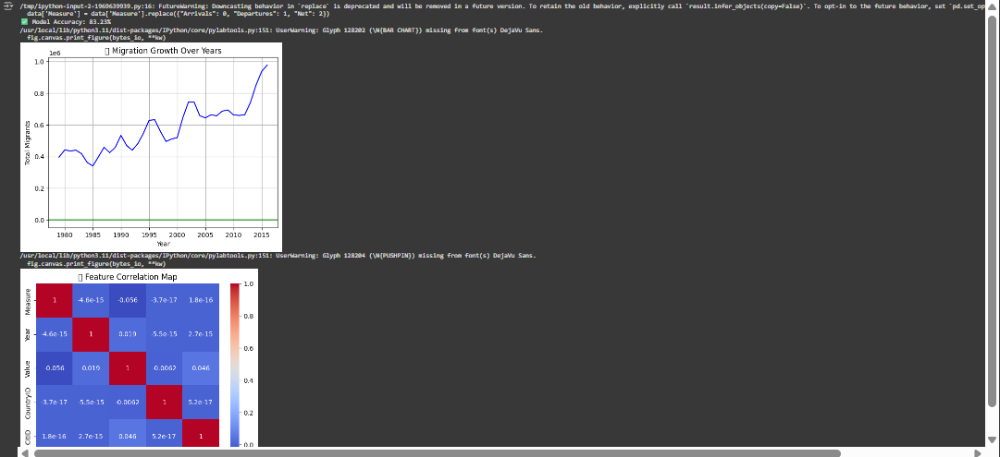

# 🌍 Human Migration Predictor (Machine Learning Project)

A real-world machine learning model that predicts global human migration using data from New Zealand.

## 🔧 Tech Stack
- Python, Pandas, Matplotlib, Seaborn
- Scikit-learn (Random Forest Regressor)
- Google Colab or Jupyter

## 📊 Results
- Achieved 83.23% accuracy
- Visualized migration growth by year
- Fixed 72 missing data entries with median values

## 🧠 What I Learned
- Data cleaning & encoding for ML
- Supervised regression training
- Feature engineering with real-world data

## 📂 Dataset Source
New Zealand Govt Open Data Portal

## 💡 How to Use
1. Upload `migration_nz.csv`
2. Run `migration_predictor.ipynb` notebook
3. Check prediction score & graphs

## 📷 Demo

## 🧑‍💻 Author
Richard Khristi

